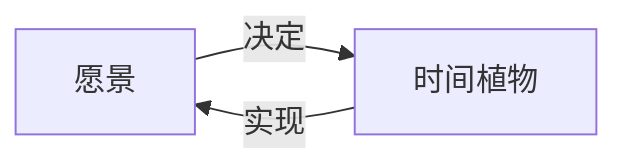
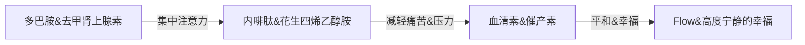

作者：王潇
阅读日期：2021-12-05
# Quote

- **No one accomplished anything by being happy and cozy**

- **重要的是成为一名战士，具体为什么而战不重要，这是你要走的路，你要力求做到极致，为了实现目标，你得直面恐惧，这就是勇士精神**。我觉得徒手攀岩的精神，就很接近武士道文化，两者都要求绝对的专注，着关乎到你的性命     —From 徒手攀岩

- Suffering is not caused by ill-fortune, by socail injustice, or by divine whims. Rather, suffering is caused by the behaviour patterns of one's own mind   -From 人类简史

- 如果你在一切时间分配中都追求[[心流]]心流，那么生活会呈现一种全新的快乐。**你需要靠智慧和勇气揭秘自己的时间排列顺序，是摸索让琐碎的时光变得丰富和隽永。在挑选时间植物再播种的过程中，人本身就是自由的。**  -From 本书




	
- 死死盯住你的愿景，未来的时间、行为和选择一定会令其慢慢清晰。 -From 本书
	- 愿景决定了我们选择什么样的时间植物，时间植物的积累又反过来吧愿景变成了现实。
	- 愿景的实现由两方面构成：一个是待解决的问题，一个是正在尝试的方法。这一切都可以凝结在每一种时间植物中。
	
- 情绪：我现在心情很差，我知道这是怎么回事，因为我处在主动生存时间里。这是我之前自己选择的道路，我知道生存时间会周期性的出现，但它是用来克服和逾越的而不是沉沦和卡住。 -From 本书

- 一个人的强体现在两方面：一核心竞争力强，二结构强。单点突出，结构自信。  -From 本书

- 没有心流，人需要通过追逐成功追逐幸福；有了心流，人可以时时刻刻追求幸福。  -From 本书

	
# 要点
- 五种时间：生存时间、赚钱时间、好看时间、好玩时间、心流时间

- 长期主义公式：底层幂次法则 --from【从0到1】
>D=P(1+R)^N
印证了长期主义者的人生：微小积累，循环增强


```text
<u>Underlined Text</u>
```

- 生存时间： 大多数人在人生的大部分时间里，因为自身能力不足和外界条件的限制，<u>无法做到主动选择而被动处于的时间分布</u>
<u>密码1：运动员了解自己，包括自己的天赋、身体素质和专业领域所处的位置</u>
你至少要分析一下自己的核心优势
<u>密码2：运动员一定要找到一个好教练，榜样，指导者</u>
行业前辈，向上寻找，了解行业和你
<u>密码3：运动员都有艰苦卓绝的训练计划</u>
<u>密码4： 运动员永远对标对手，观察对手，寻求超越</u>
<u>密码5：运动员永远在筹备下一次比赛，争取下一个赛点</u>
	
- 赚钱时间：单位时间内只对某种产品的核心竞争力做功，直至把该产品的核心价值推到远超行业平均水准的程度，这些时间就是真正的赚钱时间。

- 分配时间的原则：
1. 让可支配时间最多，表现在应该努力争取生存时间最小化
2. 让单位时间内的体验最优，表现在心流最大化
3. 让单位时间内效能最高，表现在生存时间和赚钱时间中拼尽全力。生存时间紧盯运动员密码，赚钱时间中坚持推进终极等式
4. 让可支配时间明确指向生平。你想怎么活，成为谁，就怎么安排好看时间、好玩时间和赚钱时间的比例关系和优先级


# 心流化学过程
心流是在不同寻常的状态中产生的大量神经化学物质的变化，使得我们能够以更大的精确度、更快的计算速度来感知和处理信息。就像一种大脑信息科技骤然升级。我尽量用最容易理解的语言提炼一下《盗火》描述的心流激发过程。
1.大脑首先分泌==多巴胺和去甲肾上腺素==，它们的作用是帮你==集中注意力，提升认知敏感度==。与此同时，它们开始关闭大脑对其他信息的感知。这项关闭工作很关键。
2.当心流继续深入，大脑会分泌==内啡肽和花生四烯乙醇胺==，它们的作用是==减轻痛苦和压力，让人逐渐感到舒适==。花生四烯乙醇胺具有建立大脑中信息遥远连接的能力，这就会带来创造性思考。
3.当你的心流进入极致，大脑会进入一种半睡眠状态，关闭了更多区域后，潜意识会占据主导地位。这时，多巴胺、去甲肾上腺素、内啡肽、花生四烯乙醇胺开始协同作业，按照不同浓度和节奏分泌。
4.潜意识的信息接收处理能力是大脑日常的数倍（根据研究结果至少是5倍）。这时候大脑会分泌==血清素和催产素，让人感到平和、幸福==。人会体验到一种与世隔绝的==高度宁静的幸福，同时感到处于磅礴的思考流动之中==。


