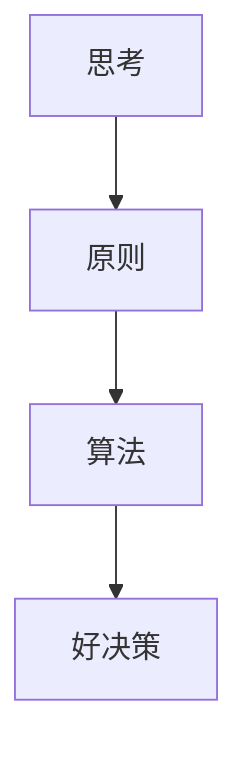

作者：瑞 达利欧
阅读日期：2021-12-11

原则：
copy现成的点
寻找原则的原则
# Quote
> 传递知识就像传递基因，其意义超过了单个的人，因为人死了基因还会延续下去。

> 把每次遭遇视为"类似情境的重现"，这一认识让我对历史抱有一种健康的尊重感，渴望对现实的机理形成普遍性的理解，并希望总结出永恒、普适的应对问题的原则。

> 我开始把现实视为一部华丽的永动机，我不过是渺小的匆匆过客，因此知道如何与这个系统良好互动，对我和系统都是有益的，我的遭遇是对我的个性和创造力的考验，我开始以一种截然不同的方式体会痛苦的时刻。我不会感觉沮丧或透不过气，而是把痛苦视为大自然的提醒，告诉我有一些重要的东西需要我去学习。==体验痛苦，然后探索大自然希望通过痛苦给我什么教益，开始成为我的一项游戏。==

> “人需要困难，这对健康来说是必需的”  -卡尔·荣格

> 任何东西在从太少变成太多的过程中，边际收益都会递减。

> 如果你找到了解决方案，弱点是不重要的.

>“杏仁核绑架”:杏仁核产生的反应是一阵爆发然后平息，而前额皮层产生的反应更为稳定和持久。

> 为了拥有最好的生活，你必须：1）知道最好的决策是什么；（2）有勇气做出最好的决策。

> 不要把概率当作可能性。==万事皆有可能，重要的是概率。==你必须考虑每个因素的发生概率，然后进行排序。能够准确区分概率和可能性的人通常善于“务实思考”，他们是“哲学家”类型的反面，而“哲学家”类型的人倾向于在各种可能性的迷雾中迷路。

>所以世界上最好的决策者是这样的人：拥有理性、想象力和毅力，知道自己看重什么、想要什么，同时也利用计算机、算法和博弈论。就像司机利用GPS一样，是用系统来辅助我们的导航能力，而不是替代它。

### 更高层面的回顾
回顾我的个人经历时，想想我的看法是如何改变的，是件很有意思的事。
最初的时候，我遇到的每一个波折，无论是在市场上还是在生活中，都显得非常重大而且十万火急，就像某种独特的生死攸关的经历，不断地朝我涌来。
积累了更多经验以后，我开始把每次遭遇视为“类似情境的重现”，我能以更平静、更严谨的方式应对，就像一位生物学家在丛林里遇到一只可怕的动物时一样：首先确定它的种属，利用已有的知识预测它的行为，然后合理地做出反应。当我面对遇到过的某类情况时，我就利用在此前类似经历中总结的原则。但当我遇到从未见过的事情时，我会大吃一惊。在研究所有这些痛苦的首次体验时，我意识到，尽管我没经历过这些事，但其中的大多数都有其他人在其他时间、其他地方经历过。这一认识让我对历史抱有一种健康的尊重感，渴望对现实的机理形成普遍性的理解，并希望总结出永恒、普适的应对问题的原则。
看到同样的事情反复发生，==我开始把现实视为一部华丽的永动机，一些原因引起一些结果，这些结果又成为原因，循环往复。==我意识到尽管现实不完美，但至少我们要直面它，因此我在现实中遇到任何问题或挫折时，都不会抱怨，而是通过更具建设性的方式找到有效的应对方法。我逐渐明白，我的遭遇是对我的个性和创造力的考验。我逐渐领悟到，在一个如此伟大的系统里，我不过是渺小的匆匆过客，因此知道如何与这个系统良好互动，对我和系统都是有益的。
在形成这个视角的过程中，我开始以一种截然不同的方式体会痛苦的时刻。我不会感觉沮丧或透不过气，而是把痛苦视为大自然的提醒，告诉我有一些重要的东西需要我去学习。体验痛苦，然后探索大自然希望通过痛苦给我什么教益，开始成为我的一项游戏。这项游戏我做得越多就越擅长，也就越不会对这些情况感到痛苦，同时思考、总结出原则、利用原则获得回报的过程也变得越来越有收获。我学会了喜爱自己的痛苦，我想这是一种健康的视角，就像学会喜爱锻炼身体一样（这一点我目前还做不到）。
拥有更多东西所产生的边际收益会很快下降。事实上，得到适量的东西比得到太多的东西更好，因为后者会伴随着沉重的负担。身处顶层会给你更大的选择空间，但也对你提出了更多要求。综合判断下，成为名人也许不如默默无闻。尽管一个人可以给其他人带来很多有益影响，但相对来看，这种影响又可以小到忽略不计。由于上述种种原因，我不能说一种充满成就的紧张人生就一定比充满享受的轻松人生更好，但是我敢说，坚强比软弱好，而拼搏让人坚强。性格使然，我不会改变自己的生活，但我无法告诉你什么样的生活对你而言是最好的。你需要自己选择。我看到的情况是，发现自己的性格，过与性格相适应的生活，才是最幸福的。

考察影响你的那些事物的规律，从而理解其背后的因果关系，并学习有效应对这些事物的原则。
- 我们能不能妥善应对我们遇到的现实，最重要的决定因素是有没有良好的应对原则。

### 1拥抱现实，应对现实
#### 1.1 做一个超级现实的人
a.梦想+现实+决心=成功的生活。

#### 1.2 真相（或者更精确地说，对现实的准确理解）是任何良好结果的根本依据

#### 1.3 做到头脑极度开放、极度透明
a.对于快速学习和有效改变而言，头脑极度开放、极度透明是价值无限的。
%% 学习过程是一连串的实时反馈循环：我们做决定，看到结果，然后根据结果改进对现实的理解。做到头脑极度开放能够增强这些反馈循环的效率，因为这能让你和其他人无比清晰地看到你在做什么、为什么这么做，而不会产生误解。你的头脑越开放，你就越不会自欺，其他人也就越会给你诚实的反馈。如果他们是“可信”的人（知道什么样的人是“可信”[3]的也很重要），你就会从他们那里受益良多。%%
b.不要担心其他人的看法，使之成为你的障碍。
- 你必须以自己认为最好的独特的方式行事，这样做肯定会有反馈，你必须开明地思考这些反馈。
c.拥抱极度求真和极度透明将带来更有意义的工作和更有意义的人际关系。

---
#### 1.4 观察自然，学习现实规律
人在尝试理解任何东西（经济、市场、天气等）时，都可以从两种视角出发：
> 1.自上而下：努力找到这些东西背后的唯一驱动法则或规律。例如，在理解市场时，人可以研究影响所有经济和市场的普适法则，如供求关系；在理解物种时，人可以集中了解基因密码是如何对所有物种发生作用的。
> 2.自下而上：研究每种具体情况及其背后的法则或规律，例如，小麦市场独特的法则或规律，或者使鸭子区别于其他物种的基因序列。
a.不要固守你对事物“应该”是什么样的看法，这将使你无法了解真实的情况。很重要的是，不要让偏见阻碍我们保持客观。想要取得好结果，我们需要冷静而不是情绪化。
b.一个东西要“好”，就必须符合现实的规律，并促进整体的进化，这能带来最大的回报。
c.进化是宇宙中最强大的力量，是唯一永恒的东西，是一切的驱动力。
d.不进化就死亡

---
#### 1.5 进化是生命最大的成就和最大的回报
>自然的一个奇妙之处是，自然中充满了个体生物，各自以符合自身利益的方式行动，不理解也不引导整体的变化，但它们构成了一个美妙运转且不断进化的整体系统。虽然我不是这方面的专家，但我觉得这是因为进化创造了：==（a）促使个体追求自身利益、最终使整体进步的激励和互动机制；（b）自然选择过程；（c）快速的试验和适应。==

a.个体的激励机制必须符合群体的目标。
b.现实为了整体趋向最优化，而不是为了个体。
c.通过快速试错以适应现实是无价的。
d.意识到你既是一切又什么都不是，并决定你想成为什么样子。
e.你的未来取决于你的视角。

---
#### 1.6 理解自然提供的现实教训
a.把你的进化最大化。
>我在前文中提到，人独特的逻辑、抽象、从更高层次思考的能力，是在大脑皮层的构造中完成的。人类大脑的这些部分比动物更发达，让我们可以反思自身，引导自己的进化。因为我们能进行有意识的、以记忆为基础的学习，所以我们能比任何物种都更快、更深入地进化，不仅一代代地进化，而且在自己的一生中进化。
b.记住“没有痛苦就没有收获”。
c.自然的一项根本法则是，为了赢得力量，人必须努力突破极限，而这是痛苦的。正像卡尔·荣格所说，“人需要困难，这对健康来说是必需的”。但多数人本能地躲避痛苦。

---
#### 1.7 痛苦+反思=进步
a.迎接而非躲避痛苦。
• 找到、接受，并学会如何应对你的弱点；
• 更喜欢周围的人对你坦诚，而不是隐瞒对你的负面看法；
• 展现真实的自我，而不是强行把弱点伪装成优势。
b.接受严厉的爱。开放的心态体验缺点，并改正。

---
#### 1.8 考虑后续与再后续的结果

>直接结果经常是诱惑，导致我们失去真正想要的东西，直接结果有时也是障碍。这就好像自然正在对我们进行分类：自然扔给我们各种暗藏玄机、结果有好有坏的选择，而那些决策时只考虑直接结果的人会受到惩罚。

---
#### 1.9 接受结果：找到自己的内控点
>我的观点很简单：不管在生活中遇到什么情况，如果你能负起责任，进行良好的决策，而不是抱怨你无法控制的东西，你将更有可能成功并找到幸福。心理学家称此为拥有“内控点”，各种研究不断显示，拥有“内控点”的人比其他人做得更好。
 所以不要为喜不喜欢自己的处境担忧。==生活根本不关心你喜欢什么。你必须根据自己的愿望找到实现愿望的途径，然后鼓起勇气坚持下去。==
 
 ----
 #### 1.10 从更高的层次俯视机器
 a.把自己想象成一部在大机器里运转的小机器，并明白你有能力改变你的机器以实现更好的结果。
 b.通过比较你实现的结果和你的目标，你就能确定如何改进你的机器。
 c.区别作为机器设计者的你和作为机器中工作者的你。
 >对人来说最难做的事情之一是客观地在自身所处环境（即机器）中看待自身，从而成为机器的设计者和管理者。大多数人一直都把自己看作机器中的工作者。如果你能够看到这两种角色之间的区别，并且看到成为自身生活的良好设计者与管理者要比成为机器中的工作者重要得多，你就走到了正确的道路上。想要取得成功，==作为设计者和管理者的你必须客观看待作为工作者的你，不高看自己，也不让自己承担不应该承担的任务。==

d.大多数人犯下的最大错误是不客观看待自己以及其他人，这导致他们一次次地栽在自己或其他人的弱点上。
e.成功的人能超越自身，客观看待事物，并管理事物以塑造改变。
==f.在你不擅长的领域请教擅长的其他人，这是一个你无论如何都应该培养的出色技能，这将帮助你建立起安全护栏，避免自己做错事。==
g.因为客观看待自身很困难，所以你需要依赖其他人的意见，以及全部证据。
h.如果你的头脑足够开放，足够有决心，你几乎可以实现任何愿望。
1. 不要混淆你的愿望和事实。
2. 不要为自身形象担心，只需关心能不能实现你的目标。
3. 不要过于重视直接结果而忽视后续、再后续的结果。
4. 不要让痛苦妨碍进步。
5. 不要把不好的结果归咎于任何人，从自己身上找原因。

### 2用五步实现你的人生愿望
1. 有明确的目标。
2. 找到阻碍你实现这些目标的问题，并且不容忍问题。
3. 准确诊断问题，找到问题的根源。
4. 规划可以解决问题的方案。
5. 做一切必要的事来践行这些方案，实现成果。

![[Pasted image 20211211164438.png]]

#### 2.1 有明确的目标

a.排列优先顺序
b.不要混淆目标和欲望。合理的目标是你真正需要实现的东西，欲望则是你想要但会阻止你实现目标的东西。欲望通常是直接结果。
c.调和你的目标和欲望，以明确你在生活中真正想要的东西。
d.不要把成功的装饰误认为成功本身。有追求成就的方向感是很重要的。有
e.永远不要因为你觉得某个目标无法实现就否决它。你要放心大胆地去做。
> 总有一条最好的道路，你要做的是找到它，鼓起勇气沿着它前进。你所认为的可以实现只是根据眼前认识做的判断。一旦开始追求目标，你会学到很多，尤其是在和他人沟通的情况下，你从未预想过的道路会呈现。

f.谨记伟大的期望创造伟大的能力。
g.如果你拥有灵活性并自我归责，那么几乎没有什么能阻止你成功。
h.知道如何对待挫折和知道如何前进一样重要。
>有时你知道你正在不可避免地走向一场大挫折。生活中总会遇到这样的挑战，有的挑战在当时看来似乎具有毁灭性。==在逆境中，你的目标应该是守住自己的成绩，尽量减少损失，或者直面不可挽回的损失。你的任务是始终做出尽可能好的选择，并清楚如果这么做，你将得到回报。==

---
#### 2.2 找出问题，并且不容忍问题
a.把令人痛苦的问题视为考验你的潜在进步机会。尽。
b.不要逃避问题，因为问题根植于看起来并不美好的残酷现实。
c.要精准地找到问题所在。
d.不要把问题的某个原因误认为问题本身。“我无法得到充足的睡眠”不是一个问题，而是一个问题的潜在原因（或者可能是问题的结果）。
e.区分大问题和小问题。你的时间和精力有限，确保你正将其用于探寻大问题，即一旦解决便能带来最大回报的问题。但同时，留出足够多的时间来探寻小问题，以确保这些小问题不是更大问题的征兆。
f.找出一个问题之后，不要容忍问题。容忍问题的结果和找不到问题一样。

---
#### 2.3 诊断问题，找到问题的根源
a.先把问题是什么弄明白，再决定怎么做。
b.区分==直接原因和根本原因==。直接原因通常是导致问题的行动（或不行动），所以通常用动词描述（我因为没有查列车时刻表而错过了火车）。根本原因是更深层的原因，通常用形容词描述（我因为健忘而没有查列车时刻表）。只有消除根本原因才能真正解决问题，为此你必须区分症状和疾病本身。
c.认识到了解人（包括你自己）的特性，有助于对其形成合理预期。

----
#### 2.4 规划方案
a.前进之前先回顾。回顾一下在你到达现在所处的位置之前，你经历过什么（或做过什么），然后设想为了实现你的目标，你和其他人未来应该怎么做。
b.把你的问题看作一部机器产生的一系列结果。通过俯视你的机器并思考如何改变这部机器以创造更好的结果来从事更高层次的思考。
c.谨记实现你的目标通常有很多途径。你只需要找出一条有效途径。
d.把你的方案设想为一个电影剧本，然后循序渐进地思考由谁来做什么事。先草拟一个大概的方案（如“招聘到人才”），然后改进。你应当从总体框架出发，一步步落实到具体任务和预计的时间线（如“在未来两周里选好能找到人才的猎头”）。
e.把你的方案写下来，让所有人都能看到，并对照方案执行。
f.要明白，规划一个好方案不一定需要很多时间。==谨记：规划先于行动！==

----
#### 2.5 坚定地从头至尾执行方案

a.规划做得再好，不执行也无济于事。
b.良好工作习惯的重要性常被大大低估。成功执行方案的人都拥有合理排序的应做事项列表，并确保每一项都有井然有序的标记。
c.建立清晰的衡量标准来确保你在严格执行方案。理想的做法是让其他人客观评估并报告你的进度。如果你未能实现目标，这就是另一个需要诊断和解决的问题。很多成功、有创造力的人士都不善于执行，他们因和高度可信赖的任务执行者建立互助互利的关系而取得了成功。

---
#### 2.6 谨记：如果你找到了解决方案，弱点是不重要的

a.考察你犯错误的类型，并识别你通常在五步流程中的哪一步上做得不好。你还需要请其他人就此表达意见，因为所有人都无法彻底客观地看待自己。
b.每个人都至少有一个最大的弱点阻碍其成功，找到你的这个弱点并处理它。把你最大的弱点写下来（如找出问题、规划解决方案、执行落实），并写下其原因（如你被情绪左右，你无法预见各种合理的可能性）。尽管包括你在内的大多数人面临的重大障碍不止一个，但如果你能消除或者想办法规避这个最大的弱点，你将大大改善你的人生。只要你认真对待，你将几乎肯定能成功处理这个最大的弱点。

你可以自己把它处理掉，也可以找人帮你更好地处理。成功有两条路：（1）自己拥有成功所需的要素；（2）从其他人那里得到成功所需的要素。第二条路需要你谦逊。谦逊和你自己有能力一样重要，甚至比你有能力更重要。谦逊和能力兼有是最好的。下一页上有一幅图，你可能会觉得有帮助。

----
#### 2.7 理解你和其他人的“意境地图”与谦逊性

有的人很擅长自己把问题和解决办法搞明白，这样的人拥有良好的“意境地图”。也许他们通过学习掌握了这种能力，也许他们天生就富有理性和常识。无论是哪种情况，他们自己找到解决方案的能力更强。同时，还有一些人比其他人更谦逊，头脑更开放。如果谦逊能引导你找到比自己想出来的更好的解决办法的话，就可以说谦逊比拥有良好的“意境地图”价值更大。既头脑开放又拥有良好“意境地图”的人是最强大的。

### 3做到头脑极度开放

----
#### 3.1 认识你的两大障碍
a.理解你的自我意识障碍。“自我意识障碍”是指你潜意识里的防卫机制，它使你难以接受自己的错误和弱点。你有一些根植于内心最深处的需求和恐惧，例如需要被爱，害怕失去别人的爱；需要生存，害怕死亡；需要让自己有意义，害怕自己无意义

- 原始部分，如杏仁核。这些原始部分都是大脑颞叶里的构造，而颞叶处理情绪。因为你大脑的这些区域是你感知不到的，所以你几乎不可能理解它们需要什么，它们如何控制你。这些区域会简单化地处理事物，做出本能的反应。
- 而前额叶是大脑的高级部分，你会清醒的意识到你在做决策

b.“两个你”在争夺对你的控制权。
c.理解你的思维盲点障碍。

#### 3.2 奉行头脑极度开放
> 头脑极度开放的基础是一种真诚的担忧：你在决策时看到的情况也许并不是最符合事实的情况。头脑极度开放是一种能力：有效地探析各种不同的观点和不同的可能性，而不是让你的自我意识或思维盲点阻碍你。这需要你克服对自己始终正确的渴望，愉悦地探求事实。奉行头脑极度开放的话，较低层次的你就无法控制你，而始终是较高层次的你在观察和考量所有不错的选择，做出最佳决策。如果你能获得这种能力（只要练习你就能），你将能更有效地应对各种现实情况，大大改善自己的生活。

a.诚恳地相信你也许并不知道最好的解决办法是什么，并认识到，与你知道的东西相比，能不能妥善处理“不知道”才是更重要的。
b.认识到决策应当分成两步：先分析所有相关信息，然后决定。
c.不要担心自己的形象，只关心如何实现目标。
d.认识到你不能“只产出不吸纳”。大多数人的情况是，与“吸纳”（学习）相比，“产出”（表达想法和制造东西）的热情似乎要高得多。就算一个人的首要目标是“产出”，这也是一个错误，因为不“吸纳”的话“产出”也不会好。
e.认识到为了能够从他人的角度看待事物，你必须暂时悬置判断，只有设身处地，你才能合理评估另一种观点的价值。
f.谨记，你是在寻找最好的答案，而不是你自己能得出的最好答案。最好的答案不一定是你想出来的，你可以在其他人那里找。如果你真的客观看待事物，你就必须承认，你总是拥有最好答案的可能性是很小的，
g.搞清楚你是在争论还是在试图理解一个问题，并根据你和对方的可信度，想想哪种做法最合理。

#### 3.3 领会并感激：深思熟虑的意见分歧
>要做好这一点，你的沟通方式应该要让对方觉得，你只是在试图理解。[2]你应该提问而不是做出陈述，以平心静气的方式进行讨论，并鼓励对方也这么做。记住，你不是在争论，而是在开放地探求事实。你要保持理性，并期待对方也保持理性。如果你冷静，平等对待对方，尊重对方，效果就会好得多。练习可以让你更擅长这么做。

#### 3.4 和可信的、愿意表达分歧的人一起审视你的观点
#### 3.5 识别你应当注意的头脑封闭和头脑开放的不同迹象
==a.经常利用痛苦来引导自己进行高质量的思考。这可能有些难：大脑杏仁核会收缩，你也许会觉得它在踢你，你的身体会紧张，或者你的心中会涌起一种恼怒感，想发脾气。每当出现这些情绪时，你都需要注意，这些都是头脑封闭的迹象。意识到这些迹象后，你就可以将其作为线索来控制自己的行为，引导自己走向头脑开放。长期这样练习将增强你的能力，让“更高层次的你”始终处于控制地位。你练习得越多，你的能力就会变得越强。==
b.将头脑开放作为一种习惯。
当然，马上让人做到这一点是很难的，因为你各种“较低层次”的情绪非常强大。但好消息是这==种“杏仁核绑架”[3]通常不会持续很长时间，所以尽管你一时难以控制自己，你还是可以有一段缓冲时间，给“较高层次的你”以空间来进行高质量的反思。你也可以让你尊重的人来帮助自己。==
c.认识自己的思维盲点。
d.假如很多可信的人都说你正在做错事，只有你不这么看，你就要想想自己是不是看偏了。一定要客观！虽然也有可能你是对的，他们都错了，但你应该从吵架模式转换到“提问”模式，比比你和其他人的可信度，在必要时同意让某个你们都尊重的中立第三方来打破僵局。
e.冥想。我经常练习“超验冥想”，并相信这让我变得更加头脑开放，能从更高的层面看问题，镇定自若，富有创造力。冥想能让人看到慢节奏的画面，所以即使面对混乱，我也能保持平静，就像一场街头斗殴中的忍者一样。我。
f.重视证据，并鼓励其他人也这么做。
g.尽力帮助其他人也保持头脑开放
h.使用以证据为基础的决策工具。
i.知道什么时候应当停止为自己的观点辩护，信任自己的决策程序。独立思考，努力为自己相信的观点辩护，都是很重要的，但总会有些时候，更明智的做法是停止为你的观点辩护，接受可信的其他人的观点。

### 4理解人与人大不相同 
#### 4.1 明白你与其他人的思维方式能带来的力量
a.我们拥有各种天生特征，既可能帮助自己也可能伤害自己，取决于如何应用。大多数特征都是“双刃剑”，可能带来好处和害处。特征越极端，它可能带来的好处或害处就越极端。
> 一“所有脊椎动物共有的脑”的进化是自下而上进行的，也就是说，较低的区域是进化意义上最古老的，顶层区域是最新的。脑干控制着维系各种生物生命的潜意识过程，包括心跳、呼吸、神经系统，以及应激程度和机敏程度。脑干上面的小脑负责让肌肉对感觉做出反应，从而控制肢体的运动。再上面是大脑，包括基底核（控制习惯）、边缘系统的其他部分（控制情绪反应和一些动作）、大脑皮层（产生记忆、思想和意识）。大脑皮层最新和最发达的部分，即看起来像一堆肠子的脑灰质褶皱，称为新皮层，人的学习、计划、想象等更高级的思想就从这里产生。正是因为有新皮层，所以人类的脑灰质比例显著高于其他物种。

#### 4.2 有意义的工作和有意义的人际关系不仅是我们做出的美好选择，而且是我们天生的生理需求
![[Pasted image 20211211173045.png|400]]

#### 4.3 理解大脑里的主要斗争，以及如何控制这些斗争，以实现“你”的愿望.

a.要明白，意识与潜意识在不断斗争。
- 坏：潜意识里的恐惧和欲望通过爱、恐惧、灵感等情绪，让我们产生各种意图和行为。这是生理性的。例如，爱意就是脑下垂体分泌的各种化学物质（如催产素）产生的。
- 好：我们的灵感大爆发往往就是从潜意识区域“喷出”的。我们经历这些创造性突破的时刻，通常是在放松、不试图与它们所在的大脑区域（通常是新皮层）沟通的时候。
- 谨慎行事：我已经养成习惯，当我的潜意识给我想法和提示时，我不是马上按照其行动，而是先用我的理性意识去分析它们。我发现，这么做除了能帮助我分清哪些想法是有效的，我为什么会对这些想法产生特定的反应，还能让我的意识与潜意识之间的通信变得更多。

b.要知道最常发生的斗争是情绪和思考的斗争。
情绪和理性思考之间的斗争是最大的斗争。情绪主要是由潜意识性的杏仁核控制的，而理性思考主要是由意识性的前额皮层控制的。如果你能理解这些斗争是如何发生的，你就能理解为什么说把你潜意识产生的东西和意识产生的东西相调和是非常重要的。
当什么东西（可以是某种声音、某个场景，或者仅仅是某种直觉）让我们不快时，杏仁核就向身体发出准备战或逃的信号：心跳加速、血压升高、呼吸加快。在与人争论时，你经常可以注意到一种类似于恐惧时的生理反应（例如心跳加速、肌肉绷紧）。你的意识（源自前额皮层）在感受到这些信号后可以拒绝执行。这些“杏仁核绑架”现象通常来得快、去得也快，只有极少数例外，如因经历某个或一系列可怕事件而出现创伤后应激障碍的人

c.调和你的情绪和思考。对大多数人而言，生活就是大脑这两个部分永无止境的斗争。“杏仁核绑架”:杏仁核产生的反应是一阵爆发然后平息，而前额皮层产生的反应更为稳定和持久。

d.善择你的习惯。在你脑子的各种工具里，习惯也许是最强有力的一个。习惯是由大脑底部的基底核驱动的，那是一块高尔夫球大小的组织。基底核控制着你的行为，但它藏得很深，本能地运行，所以你意识不到它。
只要频繁反复练习，你几乎可以养成任何习惯，产生自控力。好习惯让你实现“较高层次的自我”的愿望，而坏习惯是由“较低层次的自我”控制的，阻碍前者的实现。如果你明白大脑的这一部分是如何工作的，你就能养成一系列更好的习惯。

练出这种能力需要一些努力。第一步是认识到习惯是怎么产生的。习惯本质上是惯性，一种继续把你一直做的事情做下去（或者继续不做你一直不做的事情）的强烈倾向。==研究显示，如果你能坚持某种行为约18个月，你就会形成一种几乎要永远做下去的强烈倾向。==

e.坚持友善地训练“较低层次的你”，以养成好的习惯。我过去一直以为，较高层次的自我需要和较低层次的自我斗争，夺取控制权，但我逐渐明白，更有效的做法是训练潜意识的、情绪性的自我，就像教育儿童听话一样。你需要坚持慈爱友善地训练它，以让自己养成好习惯。

f.理解右脑思维和左脑思维的差别。你的大脑分为负责意识的上层和负责潜意识的下层，同时还分为左、右半球。
1.左脑按顺序推理，分析细节，并擅长线性分析。“左脑型”或“线性”思考者分析能力强，通常被形容为“明智”。
2.右脑思考不同类别，识别主题，综合大局。富有“街头智慧”的“右脑型”或“发散”思维者，通常被形容为“机灵”。

#### 4.5 无论你要实现什么目标，让合适的人各司其职以支持你的目标，是成功的关键

a.管理你自己，并协调其他人实现你的目标。你最大的挑战是让深思熟虑的较高层次的自我管理情绪性的较低层次的自我。做到这一点的最佳途径是有意识地养成习惯，自动地做对自己有益的事。

### 5学习如何有效决策
#### 5.1 要认识到：（1）影响好决策的最大威胁是有害的情绪；（2）决策是一个两步流程（先了解后决定）

必须：（1）综合分析眼前的形势；（2）综合分析变化中的形势；（3）高效地综合考虑多个层级。
#### 5.2 综合分析眼前的形势
为了做到高效，你必须能分清哪些“点”重要，哪些不重要。
a. 你能做的最重要的决定之一是决定问谁。
b. 不要听到什么信什么。
c. 所有东西都是放在眼前看更大。
d. 不要夸大新东西的好处。
e. 不要过度分析细节。

#### 5.3 综合分析变化中的形势

当你要确定某个事物可接受的改善速度时，你需要注意的是事物水平相对于改善速度的关系。你生命中越重要的的东西需要以足够快的速度不断改善。

a. 始终记住改善事物的速度和水平，以及两者的关系。
b. 不必过于精确。
c. 谨记“80/20法则”，并明白关键性的“20%”是什么。
d. 不要做完美主义者。

#### 5.4 高效地综合考虑各个层次
a. 用“基线以上”和“基线以下”来确定谈话位于哪一层。
b. 谨记，决策需要在合理的层次做出，但也应在各层次之间保持一致。

1.谨记任何问题都存在很多层次。
2.针对一个问题，明白你分析的是哪个层次。
3.有意识地在不同层次之间转换，而不是把问题视为一堆没有内在区别、可以随意考察的事实。
4.以下页图为模板把你的思考过程画成图。

#### 5.5 综合分析现实、理解如何行动的最好工具是逻辑、理性和常识
利用决策逻辑来创造长期的最佳结果，本身已经成为一门科学。这门科学利用了概率学和统计学、博弈论等工具。尽管这些工具很多都能带来帮助，但有效决策的基本要素是相对简单和永恒的，事实上在不同程度上以基因的形式存在于人脑里。通

#### 5.6 根据预期价值计算做决策
有时即使你押错的可能性非常大，但押错的成本几乎可以忽略不计，而押对的概率虽然很小，奖励却很高，在这种情况下，试一下仍然是明智的。就像俗话说的：“多问问总没坏处。”

a. 不管你押对的概率已经有多大，提高你的押对概率始终有价值。
b. 知道什么时候不要去押注，和知道什么注值得押同样重要。
c. 最好的选择是好处多于坏处的选择，不是毫无坏处的选择。

#### 5.7 比较更多信息带来的价值和不做决定造成的成本，决定优先顺序
a. 先把你的“必做之事”做完，再做你的“想做之事”。
b. 你很可能没有时间处理不重要的事，那最好将它留着，以免自己没有时间处理重要的事。
c. 不要把概率当作可能性。
不要把概率当作可能性。万事皆有可能，重要的是概率。你必须考虑每个因素的发生概率，然后进行排序。==能够准确区分概率和可能性的人通常善于“务实思考”，他们是“哲学家”类型的反面，而“哲学家”类型的人倾向于在各种可能性的迷雾中迷路。==

#### 5.8 简化
#### 5.9 使用原则
（1）让你的思维慢下来，以注意到你正在引用的决策标准。
（2）把这个标准作为一项原则写下来。
（3）当结果出现时，评估结果，思考标准，并在下一个“类似情境”出现之前改进标准。
#### 5.10 对你的决策进行可信度加权
你必须避免以下常见失误：（1）不合逻辑地高估自己的可信度；（2）不区分可信度不同的人。
在与其他人产生分歧时，应该首先看看你们能不能就决策原则达成一致。在进行这样的讨论时，你们应该分析不同原则背后理由的优劣。如果能就决策原则达成一致，你们就把原则应用于眼前的问题，得出一个人人赞同的结论。如果对决策原则有分歧，你们可以通过比较彼此的可信度来努力解决分歧。我将在“工作原则”中更详细地解释具体做法。

#### 5.11 把你的原则转换成算法，让计算机和你一起决策
能做到这一点，你将把自己的决策能力提高到一个全新的水平。通过这么做，很多时候，你将能检验原则在应用于过去的情况和各种不同的情况时能起到什么样的作用，这能帮助你改进原则。而且这么做肯定能让你对问题有飞跃式的深入理解。这还能将情绪因素从决策中去除。就像文字一样，算法也能描述你的计划，只是用计算机能理解的语言记录而已。如果你不会使用这种语言，你就应该学会，或者找一个能为你翻译的帮手。你的子女和伙伴必须学会使用这种语言，因为它可能很快会成为全世界最重要的语言。

==算法表述投资决策标准，然后用历史数据来检验，或者用算法表述工作原则，然后用其来帮助管理决策，都不过是智能温度调节器的更大、更复杂的版本。与人脑决策相比，这能让我们更快地做出考虑更周全、更少情绪化的决策。==
我相信这种做法会变得越来越普遍，计算机编码会变得和写字一样重要。计算机在帮助决策方面的作用，迟早会变得像它们今天在收集信息方面的作用一样大。当计算机帮助我们决策的时候，它们将了解到我们的情况，包括我们的价值观、长处和短处。它们将能自动地找到在特定领域比我们更强的人的帮助，从而能给我们提供合适的建议。不久之后，我们的计算机就能和其他人的计算机对话，并以上述方式合作。事实上这已经在发生了。

设想这样一个世界：你能利用科技接入一个系统，可以在系统里输入你正在处理的问题，并向全世界这方面最受好评的思考者请教解决办法，以及背后的理由。这一点将很快得以实现。不久后，在几乎所有你面临的问题上，你都能利用全世界最高质量的思考，并得到能权衡不同观点的计算机化系统的指导。例如，你将可以询问，基于自己的情况，你应当选择什么样的生活方式或职业生涯，或者基于其他人的情况，你应当如何与他们沟通。这些创新将把人从自己的头脑中解放出来，释放出一种无比强大的集体思维模式。桥水正在这么做，并发现这种思维模式比传统思维方式好得多。

这种人和机器的结合很美妙。人脑与科技合作的进程促使人类进步，正是凭着这么做，人类从茹毛饮血走向了信息时代。所以世界上最好的决策者是这样的人：拥有理性、想象力和毅力，知道自己看重什么、想要什么，同时也利用计算机、算法和博弈论。我们在桥水利用计算机系统，就像司机利用GPS一样，是用系统来辅助我们的导航能力，而不是替代它。

5.12 在深刻理解人工智能之前不要过度信赖它