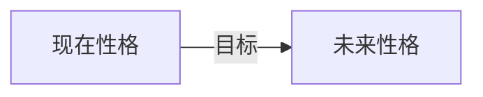

作者：【美】本杰明.哈迪
阅读日期：2021-12-07

性格不变，生活stays the same的原因不是因为性格不变，而是因为我们逃避变化。

愿景（使命），行为，时间，选择  你是由这些创造出来的。

>==真我是你所最笃信的、最想成为的自己。另外，真我是会变的。本真在于诚实，诚实在于面对真相，而不是因为不想进行艰难的对话就给自己的局限性找理由。==

>性格的真相是，性格可以、应该也确实会改变。目标塑造身份认同，身份认同塑造行动，行动会塑造你<u>现在和未来</u>的性格。

### 对性格的误解:
※ 性格以“类型”区分
※ 性格是内在和固定的
※ 性格来自过往经历：记忆不是被储存的客观食物，而是当下自我的有机组成部分，当下的情绪和未来的目标会影响我们的记忆
※ 性格只能被“找到”:情绪是通往成长和学习的大门。人们的性格之所以止步不前，并循环反复，是因为他们在逃避学习中以及与他人交往中遇到的棘手的、有挑战性的情绪
※ 性格是“本真的”自我

![[Screen Shot 2021-12-07 at 4.01.58 PM.png|400]]

- 性格是果，不是因。性格主要是由你的<u>1目标、2身份认同和3源于目标的行为</u>塑造而成的。对于大多数人来说，性格都是对人生际遇、环境和社会压力的反应，未经有意规划、扪心拷问和审慎选择。--性格在主观能动性下是动态发展的
- 目标塑造身份认同、形成性格。一切人类行为的根本动力和原因都是目的、目标或使命。
	-  再无用的行为也有目标驱使。拖延和分散注意力有目的，哪怕只是为了让自己麻木一会。
-  世界上最成功的人知道，工作是帮助他人、为他人创造价值。正如钮波特所说，“如果你想爱上自己的工作，那就放下热情思维（‘世界能为我带来什么’），换上工匠思维（‘我能为世界带来什么’）吧”。
-  结婚要看是否志同道合，而不是看性格。共同的使命会逐渐改造你们双方。稳固的关系不在于“找到”，而在于通过这段关系共同创造并成为新人。
-  真我是你最笃信的、最想成为的自己。另外，真我是会变的。本真在于诚实，诚实在于面对真相，而不是因为不想进行艰难的对话就给自己的局限性找理由。==

#### 目标的三个来源:
1. 接触：目标基于你接触到的事物，拓宽情景
2. 欲望：欲望训练是靠主动的、有意识的追求。先有投入，之后才能有热情
3. 信心：信心是想象力的基础——人必须有想象力才能预见和选择超越当下自身能力的未来。
	- 信心越大，未来自己就越强。
	- 信心是通过勇敢的行为铸就的。
	- 步伐越勇猛，高峰体验就会越多。
	- 比起遥远的过去，信心更多是基于你近期的情况。

>自信心源于在制定远远超出现在能力的目标上取得进步。-丹 沙利文
>
>欲望是一切成就的起点，不是希望，不是愿望，而是超越一切的热切渴望。 -拿破仑 希尔
>
>如果你想要正反馈（或者高峰体验）的话，最好的办法就是投入积极的、有目的性的心态……抑郁……自然是消极被动的产物。高峰体验来自一种有意识的态度。-哲学家科林·威尔逊（Colin Wilson）

#### 根据目标刻意设计身份认同：
>想象力比知识更重要。因为知识仅限于我们当下的认知和理解，而想象力包含整个世界以及未来一切可能的认知和理解。
——阿尔伯特·爱因斯坦（Albert Einstein）

#### 核心目标：
##### 皮尔逊定律
>皮尔逊定律（Pearson’s Law）提出：“测量绩效，绩效就会改善。测量并报告绩效，绩效就会加速改善。”
>
>拿破仑·希尔说过：“以绝对信念为后盾的明确目标是一种智慧，而智慧的行动会带来正面的结果。”“我试试”或者“走一步看一步吧”不需要多少信念。但“一定会做到。我不清楚具体怎样做到，但我知道一定会做到”就需要强烈的信念。
>
>哈佛大学商学院的教授克莱顿·克里斯滕森说过：“在100%的情况下坚持自己的原则要比在98%的情况下坚持来得容易。”

##### 期望理论
 单个目标带来专注。专注带来动力。动力和信心会影响生活所有方面。
 根据研究最深入、最核心的激励理论之一的[[期望理论]]（expectancy theory），高激励水平需要以下三点：
·明确且迫切的目标或成果
·有信心达成目标的路径或过程
·对行动和成功的信念!

##### 方法
- 早睡早起：
	- 早睡一小时是避开晚间低效率陷阱的好方法：一天的结束是放松和反省的时间，而非不健康的消耗。到了一天结束时，你已经做出了很多决定，筋疲力尽。于是，你的意志力完全枯竭了。意志力低迷会导致不健康的高消耗行为——大多是寻求多巴胺的迅速分泌。
	- 早早醒来，然后马上大踏步追寻自己的梦想，你就会树立起信心和动力，让你一整天都活力满满。你会做出更好的决定，与周围人的关系也会融洽得多。于是，你的24小时都会过得更好。
	
- 写日记：内化并清晰目标，晚上或者早上都可以；记录进步同时牢记未来的自己

##### 高峰体验
>马斯洛是这样定义高峰体验的：“罕见、激动人心、广阔、深刻、使人振奋的体验，这样的体验带来了更高级的现实体验，对体验者造成了奥妙神奇的影响。”

#### 总结-性格重建流程

![[Screen Shot 2021-12-07 at 3.59.57 PM.png|500]]

### 性格的影响因素：
==1. 创伤。创伤可以将你困在过去，也可以激发巨大的转变与成长。
2. 身份认同叙事。它指讲述的关于自己的故事，可以基于过往经历，也可以基于你想要的未来。--意义感对我们的重要性
3. 潜意识。潜意识会将你拉回稳态，但也可以通过情绪体验和属于未来自我的行为来不断提升。
4. 环境。环境可以让你维持现状，也可以迫使你进步，成为一个新人。==

如果没有战略性眼光来管理这些因素，这四个因素就会把你困在重复和可预测的轮回中。反之，性格就会发生剧烈的变化。

#### 情绪调控
- 情绪[[五种时间#Quote]]调控的第一步是在情绪出现时就加以认定并贴上标签（尽可能详尽描述）。如果没有意识到自己的情绪，也就无法管理情绪。
- 情绪调控的第二步是理解原始情绪和衍生情绪之间的区别。
	- 原始情绪是你对外部事件的最初反应。你不应该评判它们。它们是我们对周遭事物的自然反应。比如说，爱的人去世会悲伤、堵车时会心烦都是自然的第一反应。
	- 衍生情绪是对感受本身的感受。比如说，你在感到受伤时可能会为此愤怒，在焦虑时可能会为此感到羞耻。衍生情绪会让你的反应更加强烈，可能会让你做出破坏性的行为。因此，灵活心态的一部分含义就是放下最初的反应——不要太在意或者对号入座，而是要承认它，给它贴上标签，然后决定自己想要如何解读和感受这段经历。
- 情绪调控的第三步是放下负面情绪。不能假装自己没有负面感受，承认并接受它是释怀的关键。接下来，你要从情绪中后退一步，考虑按照它行动的结果。结果往往不符合未来的你的价值观和目标。
人们常常因为一时冲动、不顾后果而做出愚蠢的决定。比如说，压力大的时候狂吃曲奇饼可能在一开始感觉不错，但终究会造成负面结果。结果才是你要考虑的，因为结果会决定你长远的感受，是结果创造了未来的你。

身体是情绪性的：
==情绪将身体、记忆和身份认同黏合在一起。==
在大脑和全身各处传递的信息本质上属于情绪。这些信息——情绪的内容——进而会变成身体。
情绪是化学物质，我们的身体会熟悉或习惯这些化学物质。以多巴胺为例。你的身体习惯了一定量的多巴胺，当体内多巴胺水平低下时，身体实际上就需要更多这种化学物质。
![[Screen Shot 2021-12-07 at 5.26.41 PM.png|400]]

#### 意义感
意义与意义形成方面的心理学专家克里斯特尔·帕克（Crystal Park）博士认为，人是通过连接以下三者来从经验中创造意义的：
·首先，我们对事件或经历定义原因。（“刚才发生了什么？”）
·接着，我们将起因与身份认同相连。（“这段经历与我有何相关性？”）
·最后，我们将起因与身份认同关联到更宏大的世界观与宇宙观。（“这段经历，还有我的身份认同与世界有何相关性？”）
创造意义对我们是谁、我们会成为谁至关重要。我们大部分的性格是基于我们赋予先前经历的意义，基于我们赋予各个目标或价值的意义，基于我们的关注点。性格甚至会基于我们赋予小事的意义，比如玩笑、音乐、风格或兴趣。

#### 身份认同
第一步：真诚地审视你现在让自己走向的未来
第二步：写自传
第三步：想象3年后的自己
第四步：向大家讲述未来的你

你想在三年后成为怎样的人？一定要具体。
你的收入会有多少？
你会有哪些朋友？
你会如何度过平常的一天？
你会穿什么类型的衣服？
你会留什么发型？
你会做什么类型的工作？
你会在什么样的环境中？
如果你之前不常设想未来，也许可以先想象90天后的自己。
90天后你想成为怎样的人？
在那之前，你想做成什么事？
你想有怎样的变化？
你想为所处的环境带来怎样的变化？

#### 潜意识
提升潜意识的方法：
一、断食和休息
二、做慈善

#### 环境策略
尽管人们往往只是环境的产物，但你必须学会让自己的环境符合你想要的结果。这样一来，性格自然会随之而动。
具体来说，本章会教你三条环境设计的基本策略：
1. 记忆策略
2. 忽视策略
3. 约束情形

记忆策略：针对目标，进行选择性记忆  如设立标语
忽视策略：学着对你的关注点做减法。输入决定视野。视野决定输出。输出决定未来
约束情形：逼自己一把，才能看到更多潜能。约束情形指的是任何逼迫你采取行动、产出成果的情形。在约束情形下，你只有一个选项，那就是你想要的选项。你设计出这种情形来逼迫你走上自己想要的方向。

个人来说，环境是最强大、最重要的影响因素之一。如果你对改变自己和改变人生是认真的，你就必须改变自己的环境。
你是所处文化与情境的产物。你是你接收的信息和输入的产物。一切进入的东西——食物、信息、人、经历——都在塑造你。第一步，认识自己的情境及其对你的影响。第二步，有策略地处置自己的环境与情形。
不要让环境和境遇反映你的身份认同，而要设计自己的环境，让它反映未来的你。要让环境成为一股水流，推着你前进，而不是把你往后冲

